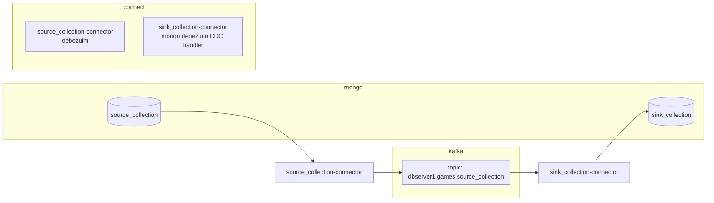

# Mongo Source and CDC Sink

This project setup Kafka Connect and sync 2 Mongo collections.
- source - source_collection
- target - sink_collection

Requires docker-compose to run.
- Suggest to use [Rancher Desktop](https://rancherdesktop.io/) for mac

## Docker Services Setup and Data Flows


## References
- [Debezium Mongo Source Connector](https://debezium.io/releases/2.4/)
- [Mongo Debezium Sink Connector](https://www.mongodb.com/docs/kafka-connector/current/tutorials/)
- [Mongo CDC Handler](https://www.mongodb.com/docs/kafka-connector/current/sink-connector/fundamentals/change-data-capture/)

## Downloads (already included in this folder)
- [Debezium 2.4.0 Drivers](https://repo1.maven.org/maven2/io/debezium/debezium-connector-mongodb/2.4.0.Final/debezium-connector-mongodb-2.4.0.Final-plugin.tar.gz)  
  Unzip to folder connectors/debezium-connector-mongodb-2.4
- [Mongo Kafka Connect Plugins](https://www.mongodb.com/docs/kafka-connector/current/introduction/install/)  
  Copy mongo-kafka-connect-1.11.0-all.jar to folder connectors/mongodb-connector

## Running the End to End Tests
```
# This export is a must for docker compose to run successfully.
export DEBEZIUM_VERSION=2.4

# kafka, mongo and kafka connect with debezium source installed
docker-compose up -d

# initialize mongodb
docker-compose exec mongodb bash \
  -c '/usr/local/bin/mongo-config/init-mongodb.sh'

# load games
docker-compose exec mongodb bash \
  -c '/usr/local/bin/mongo-config/init-gamesdb.sh'

# start source connector
curl -X POST -H "Accept:application/json" -H  "Content-Type:application/json" \
  http://localhost:8083/connectors/ \
  -d @connector-config/debezium-source-2.4.json | jq

# start sink with CDC handler
curl -X POST -H "Accept:application/json" -H  "Content-Type:application/json" \
  http://localhost:8083/connectors/ \
  -d @connector-config/debezium-cdc-sink.json | jq

# check connector status
curl http://localhost:8083/connectors/source_collection-connector/status | jq
curl http://localhost:8083/connectors/sink_collection-connector/status | jq

# console consumer to watch cdc events
docker-compose exec kafka /kafka/bin/kafka-console-consumer.sh \
  --bootstrap-server kafka:9092 \
  --from-beginning \
  --property print.key=true \
  --topic dbserver1.gamesdb.source_collection

# mongo shell to modify db
docker-compose exec mongodb bash \
  -c 'mongo -u $MONGODB_USER -p $MONGODB_PASSWORD \
  --authenticationDatabase admin gamesdb'

    # verify snapshot completed
    db.source_collection.find({_id:ObjectId("dac98765432a01b23cc45b6a")})
    db.sink_collection.find({_id:ObjectId("dac98765432a01b23cc45b6a")})

    # verify insert new sync
    db.source_collection.insert({ _id:ObjectId("dac98765432a01b23cc45b6d"), model:"PS4", game:"Sunset"})
    db.sink_collection.find({_id:ObjectId("dac98765432a01b23cc45b6d")})

    # verify updates sync
    db.source_collection.update({ _id:ObjectId("dac98765432a01b23cc45b6d")},{$set:{model:"PS5"}})
    db.sink_collection.find({_id:ObjectId("dac98765432a01b23cc45b6d")})
        
    # verify delete sync
    db.source_collection.remove({_id:ObjectId("dac98765432a01b23cc45b6d")})
    db.sink_collection.find({_id:ObjectId("dac98765432a01b23cc45b6d")})

docker-compose down
```
## Evaluations
- The default CDC handler update event use _id to find and update the target document
  - probably not applicable for splitter and Opensearch use case
  - might be able to use write strategy or key serializer
  - but why not write our own CDC handler

- Debezium source connector is better than Mongo source connector
  - "after" values show the entire document in the payload
  - Configurable snapshot mode
  - this feature is not available with the Mongo source connector

## Conclusions
- Write our own CDC handler to implement our own logics (splitter, OpenSearch, etc)

